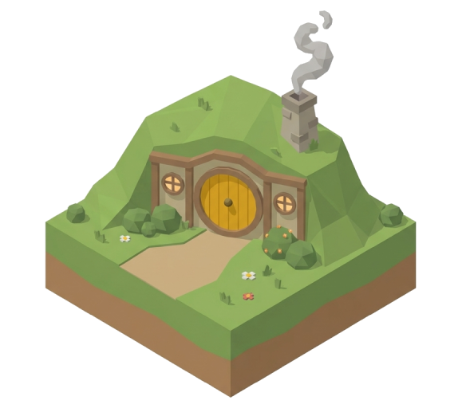
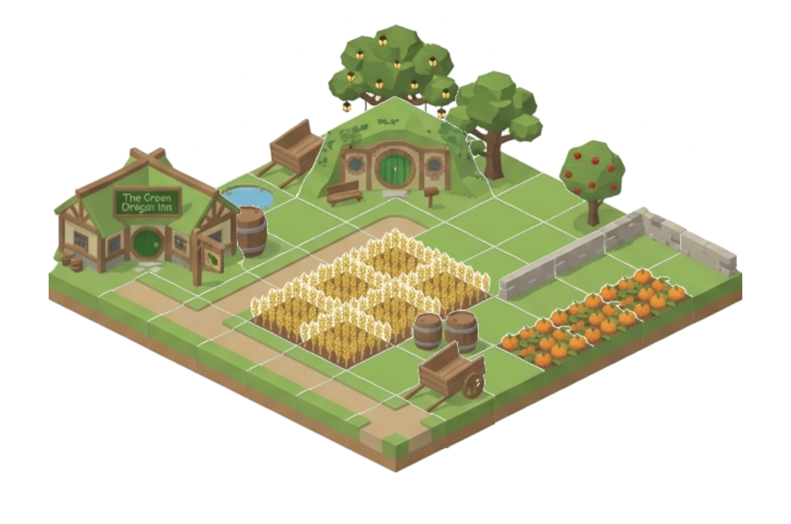

<div align="center">
  
  <h1>Iso Middle Earth</h1>
  <p><strong>An isometric Middle-earth builder — craft maps across multiple realms, tile by tile.</strong></p>

  <p>
    <a href="#features">Features</a> •
    <a href="#demo">Demo</a> •
    <a href="#getting-started">Getting Started</a> •
    <a href="#usage">Usage</a> •
    <a href="#collections">Collections</a> •
    <a href="#tech-stack">Tech Stack</a> •
    <a href="#contributing">Contributing</a> •
    <a href="#sponsor">Sponsor</a>
  </p>

  <p>
    
    
    
    
    
  </p>
</div>

---

## Demo



> 🌐 **Live:** [isomiddleearth.vercel.app](https://isomiddleearth.vercel.app/)

---

## Features

| Feature | Description |
|---|---|
| 🗺️ **Isometric Canvas** | Place tiles on a beautiful isometric grid with hover preview |
| 🌍 **Multi-Realm Maps** | Build with Shire, Gondor, Mordor, Lothlorien, Rohan, Moria, and Rivendell tiles |
| 🧪 **Mixed Mode** | Use all realm tile variants in one map from a unified picker |
| 📐 **Adjustable Grid Size** | Resize from 3×3 up to 20×20 via a slider |
| 🎨 **504 Realm Tile Variants** | 72 base tile types across 7 realms, grouped by Terrain, Water & Bridges, Trees & Vegetation, Dwellings, Buildings, and Decorations |
| 💾 **Save & Load** | Persist your builds to localStorage via Zustand — name, save, and restore anytime |
| 📸 **Export as PNG** | One-click download of your creation as a clean PNG image |
| 🖱️ **Click & Drag** | Paint tiles by holding the mouse — right-click to erase |
| 🧩 **Grouped Tile Picker** | Bottom toolbar with labeled groups, horizontal scroll, and tooltips |

---

## Getting Started

### Prerequisites

* [Node.js](https://nodejs.org/) 18+
* [pnpm](https://pnpm.io/) 9+

### Installation

```bash
# Clone the repo
git clone https://github.com/hasanharman/isomiddleearth.git
cd isomiddleearth

# Install dependencies
pnpm install

# Start dev server
pnpm dev
```

## Usage

1. Choose a realm from the top location selector or pick `Mixed`.
2. Select a tile from the bottom picker and paint on the isometric grid.
3. Right-click to erase tiles, and click-drag to paint quickly.
4. Save/load maps locally or export your map as PNG.

## Tile Assets

- Runtime source: `public/tiles/<realm>/r<row>-c<col>.png`
- Single tile sprite size: `130x230` pixels
- Isometric placement footprint on canvas: `128x64` pixels
- Optional index file: `public/tiles/manifest.json`

### Add new tile items (flexible rows/cols)

You can add any number of items per row. The app no longer assumes fixed `0..11` columns.

1. Add tile PNG files with this naming pattern:
   - `public/tiles/<realm>/r<row>-c<col>.png`
   - Examples: `r0-c12.png`, `r0-c19.png`, `r1-c5.png`
2. Register each tile in the picker config at `lib/tiles.ts`:
   - Use the correct group `row` and tile `col`.
   - You do not need to pad groups with `"Empty"` placeholders.
   - You can add new groups with new `row` indices when needed.
3. Restart the app (or refresh) and the tile will render in picker + canvas.

Notes:

- Runtime rendering supports variable row/col values and falls back to `r0-c0` if a specific tile image is missing.
- Collection validation now accepts tile coordinates as non-negative integers (`row >= 0`, `col >= 0`).

## Collections

Shared maps are available at `/collections`.

- Storage path: `collections/maps/<id>.json`
- Schema: `collections/schema/map.schema.json`
- Docs: `collections/README.md`
- CI validation: `.github/workflows/validate-collections.yml`

### How to add a map

1. Create your map in the app and note:
   - `location` (realm or `mixed`)
   - `gridSize` (3 to 20)
   - `map` matrix of tiles
2. Add a new file in `collections/maps`, for example `collections/maps/my-epic-map.json`.
3. Ensure `id` matches the filename (without `.json`), using kebab-case.
4. Validate locally:

```bash
pnpm validate:collections
```

5. Open a pull request.

Example:

```json
{
  "schemaVersion": 1,
  "id": "my-epic-map",
  "name": "My Epic Map",
  "description": "A mixed-realm mountain pass.",
  "author": {
    "name": "Your Name",
    "github": "your-github-username"
  },
  "createdAt": "2026-02-16T00:00:00.000Z",
  "location": "mixed",
  "gridSize": 7,
  "tags": ["adventure", "mixed"],
  "map": [
    [
      [0, 0, "shire"],
      [2, 4, "gondor"]
    ],
    [
      [1, 6, "mordor"],
      [3, 2, "rivendell"]
    ]
  ]
}
```

## Tech Stack

- Next.js 16
- React 19
- TypeScript
- Zustand
- Tailwind CSS

## Contributing

Issues and pull requests are welcome at [hasanharman/isomiddleearth](https://github.com/hasanharman/isomiddleearth).

## Sponsor

Support development via [GitHub Sponsors](https://github.com/sponsors/hasanharman).
